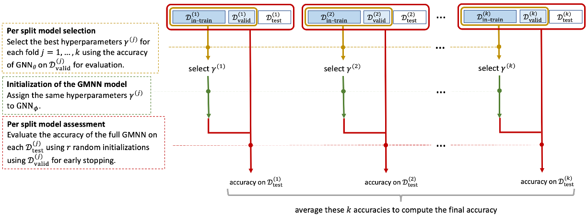

# How Graph Structure and Label Dependencies Contribute to Node Classification in a Large Network of Documents

A PyTorch implementation

**Abstract**

We introduce a new data set named *WikiVitals* which contains a large graph of 48k mutually referred Wikipedia articles classified into 32 categories and connected by 2.3M edges. Our aim is to rigorously evaluate the contributions of three distinct sources of information to the label prediction in a semi-supervised node classification setting, namely the content of the articles, their connections with each other and the correlations among their labels. We perform this evaluation using a Graph Markov Neural Network which provides a theoretically principled model for this task and we conduct a detailed evaluation of the contributions of each sources of information using a clear separation of model selection and model assessment. One interesting observation is that including the effect of label dependencies is more relevant for sparse train sets than it is for dense train sets.




## WikiVitals dataset

More infos about WikiVitals here: https://github.com/ToineSayan/wikivitals-lvl5-04-2022

## Requirements
- Python > 3.10.6 
- numpy
- scikit-learn
- scipy
- torch

## Usage

To run a Model selection : ```python main_selection_NN.py --dataset CORA-ORIG --model FAGCN --split_suffix s```<br/>
To run a Model assessment : ```python main_assessment_GMNN.py --dataset CORA-ORIG --model FAGCN --split_suffix s```

**Note 1:** For more information about default configurations used to train the models, check this subfolder.

**Note 2:** For more information about split suffix, check this subfolder. <br/>
Split suffix can be:
- s: **s**tandard splits with dense inner-train sets (10 pre-defined splits)
- 20: splits with sparse balanced train sets composed of **20** nodes of each class (10 pre-defined splits)
- spstrat: splits with **sp**arse **strat**ified train sets (10 pre-defined splits) 

**Note 3:** results of model selection phases are provided for each split and each architecture evaluated. Model assessment uses them. If someone decides to re-calculate the best hyperparameter settings, the x-file must be updated or replaced in the code.

## General informations

The code was written following the directions of the articles or adapted from the implementations provided by the authors.
The main articles and implementations used are:
- for GCN:<br/>
**Article:** Kipf, T. N., & Welling, M. (2016). [Semi-supervised classification with graph convolutional networks](https://arxiv.org/pdf/1609.02907.pdf). arXiv preprint arXiv:1609.02907. 
Press, 2021.<br/>
**Source code:** [github](https://github.com/tkipf/pygcn)
- for FAGCN:<br/>
**Article:** Deyu Bo, Xiao Wang, Chuan Shi, and Huawei Shen. [Beyond Low-frequency Information in Graph Convolutional Networks](https://ojs.aaai.org/index.php/AAAI/article/view/16514). In AAAI. AAAI Press, 2021.<br/>
**Source code:** [github](https://github.com/bdy9527/FAGCN)
- for GMNN:<br/>**Article:** Meng Qu, Yoshua Bengio, and Jian Tang. [GMNN: Graph markov neural networks](http://proceedings.mlr.press/v97/qu19a/qu19a.pdf). In International conference on machine learning, pages 5241–5250. PMLR, 2019.<br/>
**Source code:** [github](https://github.com/DeepGraphLearning/GMNN)
- Methods of evaluation for GNNs:<br/>
**Article:** Oleksandr Shchur, Maximilian Mumme, Aleksandar Bojchevski, and Stephan Gunnemann. [Pitfalls of graph neural network evaluation](https://arxiv.org/pdf/1811.05868.pdf). In Proceedings of the Relational Representation Learning Workshop (R2L 2018), NeurIPS 2018, Montréal, Canada, 2018.<br/>
**Article:** Federico Errica, Marco Podda, Davide Bacciu, and Alessio Micheli. [A fair comparison of graph neural networks for graph classification](https://arxiv.org/pdf/1912.09893.pdf). In International Conference on Learning Representations (ICLR 2020), 2020.
- Cora, Citeseer, and Pubmed:<br/>
**Datasets:** Retrieved from [GCN implementation](https://github.com/tkipf/gcn/tree/master/gcn/data) by Thomas Kipf.<br/>
**Source code:** We used [Kipf method](https://github.com/tkipf/gcn/blob/master/gcn/utils.py) to get Cora, Citeseer, and Pubmed data (and the canonical split from Planetoid). Especially, this method fixes citeseer dataset (there are some isolated nodes in the graph), it finds isolated nodes and adds them as zero-vecs into the right position.


